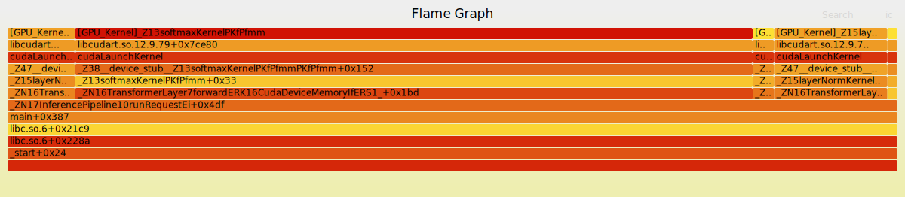

# xpu-perf: eBPF Performance Profiler for CPU & GPU

A performance profiler that combines eBPF CPU tracing with CUPTI GPU monitoring to provide complete visibility into CUDA application performance. Built using eBPF technology for zero-instrumentation profiling with minimal overhead.

**WIP， not finished yet!!!**

## Features

- **GPU+CPU Unified Profiling**: Three modes - merge (CPU+GPU), GPU-only causality, CPU-only sampling
- **eBPF-based Tracing**: Uprobes and CPU sampling for complete execution visibility
- **CUPTI Integration**: Real-time GPU kernel tracking with accurate timing
- **Symbol Resolution**: Automatic function name resolution with C++ demangling
- **Visual Flamegraphs**: Generates interactive SVG flamegraphs showing CPU→GPU causality
- **Low Overhead**: < 1% CPU overhead, < 5% GPU overhead using eBPF profiling
- **Zero Instrumentation**: No modifications needed to target applications

## Examples

CPU & GPU mixed profiling:


GPU only causality profiling:



## Quick Start

### Prerequisites

- Linux kernel 5.10+ with eBPF support
- Go 1.19+ (for building the profiler)
- CUDA Toolkit (for GPU profiling)
- Root privileges (for eBPF)
- Perl (for flamegraph generation)

### Installation

```bash
# Install dependencies
sudo apt-get install -y libelf1 libelf-dev zlib1g-dev make clang llvm git perl golang-go

# Build the profiler
cd profiler && make
```

### Basic Usage

```bash
# Profile a CUDA application (merge mode: CPU + GPU)
sudo ./profiler/xpu-perf -o output.folded ./your_cuda_app

# Generate flamegraph
flamegraph.pl output.folded > output.svg
```

## Understanding the Flamegraphs

- **CPU stacks**: Show where CPU time is spent during execution
- **GPU kernel stacks**: Show GPU execution with CPU call context
- **Width**: Represents relative time spent in each function
- **Height**: Shows call stack depth
- **Interactive**: Click on frames to zoom, search for functions

## GPU+CPU Profiling

For CUDA applications, use the integrated profiler with three modes:

```bash
# Build the profiler
make

# Default (Merge): CPU sampling + GPU kernels with call stacks
sudo ./profiler/xpu-perf -o merged_trace.folded ./your_cuda_app

# GPU-only: CPU→GPU causality (shows which CPU code launched kernels)
sudo ./profiler/xpu-perf --gpu-only -o gpu_trace.folded ./your_cuda_app

# CPU-only: Pure CPU sampling without GPU overhead
sudo ./profiler/xpu-perf --cpu-only -o cpu_trace.folded ./your_cuda_app

# Generate flamegraph
perl profiler/flamegraph.pl merged_trace.folded > flamegraph.svg

# View detailed documentation
cat profiler/README.md
```

## Testing

Test the profiler with included examples:

```bash
# Test with simple CUDA vectorAdd program
sudo -E env "PATH=$PATH" ./profiler/xpu-perf --cpu-only -o vectoradd.folded test/mock-app/vectorAdd
perl profiler/flamegraph.pl vectoradd.folded > vectoradd-flamegraph.svg

# Test with PyTorch workload (requires Python with PyTorch)
sudo -E env "PATH=$PATH" ./profiler/xpu-perf --cpu-only -o pytorch.folded python3 test/pytorch/pytorch_longer.py
perl profiler/flamegraph.pl pytorch.folded > pytorch-flamegraph.svg
```

The output flamegraphs show:
- Complete CPU→GPU call chains with symbolized function names
- Python interpreter frames and user code (for PyTorch)
- PyTorch/libtorch C++ function symbols
- CUDA runtime and driver function calls
- GPU kernel names and execution times


## Architecture

The profiler combines eBPF-based tracing with CUPTI GPU monitoring:

1. **eBPF uprobes**: Captures CPU call stacks at `cudaLaunchKernel`
   - Tracks which CPU code launches GPU kernels
   - Provides CPU→GPU causality chain

2. **eBPF CPU sampling**: Periodic stack trace sampling at 50 Hz
   - Captures CPU execution activity
   - Low overhead profiling

3. **CUPTI integration**: Real-time GPU kernel tracking
   - Monitors GPU kernel launches and execution
   - Provides accurate GPU timing via named pipes
   - JSON-formatted event stream

4. **Correlation engine**: Matches CPU stacks with GPU kernels
   - Uses correlation IDs and timestamps
   - Converts GPU duration to sample counts
   - Generates unified folded stack output

## Performance Considerations

- **Sampling Frequency**: Default 50 Hz for CPU sampling
  - Balanced overhead vs accuracy
  - GPU time converted to equivalent samples

- **Overhead**:
  - CPU sampling: < 1% overhead
  - CUPTI tracing: < 5% overhead for most workloads
  - Zero instrumentation required

- **Profiling modes**:
  - Merge mode: Best for understanding complete CPU+GPU workflow
  - GPU-only: Minimal overhead, shows GPU causality
  - CPU-only: No GPU overhead, pure CPU profiling

## License

MIT License

## Acknowledgments

- Built on eBPF technology for efficient kernel-level profiling
- Uses Brendan Gregg's FlameGraph visualization
- Inspired by Linux performance analysis tools
