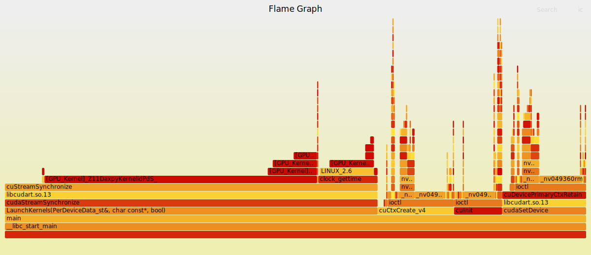

# xpu-perf: eBPF Wall Clock Profiler for CPU & GPU

A wall-clock profiler that combines on-CPU, off-CPU, and GPU profiling to provide complete visibility into application performance. Built using eBPF technology for zero-instrumentation profiling with minimal overhead.

> WIP

## Features

- **Combined Wall-Clock Profiling**: Simultaneously tracks both on-CPU execution time and off-CPU blocking time
- **Multi-threaded Support**: Automatically detects and profiles multi-threaded applications with per-thread analysis
- **Visual Flamegraphs**: Generates interactive SVG flamegraphs with color-coded on-CPU (red) and off-CPU (blue) frames
- **Low Overhead**: Less than 1% CPU overhead using eBPF-based profiling
- **Zero Instrumentation**: No modifications needed to target applications

## Examples

Wall-clock profiler:


CPU & GPU mixed profiling:



## Quick Start

### Prerequisites

- Linux kernel 4.9+ with eBPF support
- Python 3.6+
- Root privileges (for eBPF)

### Installation

```bash
# Install dependencies and build tools
make install

# Or manually install dependencies
sudo apt-get install -y libelf1 libelf-dev zlib1g-dev make clang llvm python3 git perl
```

### Basic Usage

```bash
sudo python3 cpu-tools/wallclock_profiler.py 1234 -d 30 -f 49 -m 1000
```

## Command-Line Options

```
Usage: python3 cpu-tools/wallclock_profiler.py <PID> [OPTIONS]

Arguments:
  PID                   Process ID to profile

Options:
  -d, --duration        Profiling duration in seconds (default: 30)
  -f, --frequency       On-CPU sampling frequency in Hz (default: 49)
  -m, --min-block-us    Minimum off-CPU block time in microseconds (default: 1000)
  -o, --output          Output file prefix (default: combined_profile_pid<PID>_<timestamp>)
```

## Output Files

The profiler generates several output files:

### Single-threaded Applications
- `combined_profile_pid<PID>_<timestamp>.svg` - Interactive flamegraph
- `combined_profile_pid<PID>_<timestamp>.folded` - Folded stack format data
- `combined_profile_pid<PID>_<timestamp>_single_thread_analysis.txt` - Time analysis report

### Multi-threaded Applications
- `multithread_combined_profile_pid<PID>_<timestamp>/` - Directory containing:
  - `thread_<TID>_<role>.svg` - Per-thread flamegraph
  - `thread_<TID>_<role>.folded` - Per-thread folded data
  - `thread_<TID>_<role>_analysis.txt` - Per-thread analysis
  - `<base>_thread_analysis.txt` - Overall thread analysis summary

## Understanding the Flamegraphs

- **Red frames (_[c])**: On-CPU execution time - shows where CPU cycles are spent
- **Blue frames (_[o])**: Off-CPU blocking time - shows I/O wait, sleep, locks, etc.
- **Width**: Represents relative time spent in each function
- **Height**: Shows call stack depth
- **Interactive**: Click on frames to zoom, search for functions


## GPU Profiling

For CUDA applications, use the CUPTI trace tools:

```bash
# Build CUPTI library
cd gpu-tools/cupti_trace && make

# Profile a CUDA application
python3 gpuperf.py ./your_cuda_app

# Combined CPU+GPU profiling
python3 gpuperf.py --cpu ./your_cuda_app

# View detailed documentation
cat gpu-tools/cupti_trace/README.md
```


## Architecture

The wall clock profiler combines two eBPF-based tools:

1. **oncputime**: Samples on-CPU execution using perf events
   - Captures stack traces at specified frequency
   - Tracks actual CPU consumption

2. **offcputime**: Tracks off-CPU blocking events
   - Records when threads block and for how long
   - Captures blocking reasons (I/O, locks, sleep)

3. **wallclock_profiler.py**: Orchestrates profiling
   - Runs both tools simultaneously
   - Normalizes and combines results
   - Generates unified flamegraphs
   - Handles multi-threaded applications

## Performance Considerations

- **Sampling Frequency**: Default 49 Hz balances overhead vs accuracy
  - Increase for short-lived events (up to 999 Hz)
  - Decrease for long-running production profiling

- **Min Block Time**: Default 1000 μs (1ms) filters short blocks
  - Increase to reduce data volume
  - Decrease to catch micro-contentions

- **Overhead**: Typically < 1% CPU at default settings
  - Scales with sampling frequency and stack depth


### Low Coverage Warning
This indicates the process was mostly idle during profiling. Try:
- Increasing duration
- Profiling during active workload
- Checking if the process is actually running

## Building from Source

The profiling tools (oncputime and offcputime) need to be built:

```bash
# Build the eBPF tools
cd cpu-tools
make

# Or use the main Makefile
make install
```

## Time Analysis

The profiler provides detailed time accounting:

- **On-CPU Time**: Actual CPU execution time (samples / frequency)
- **Off-CPU Time**: Blocking time from offcputime tool
- **Total Time**: Sum of on-CPU and off-CPU
- **Wall Clock Coverage**: Percentage of profiling duration covered

Coverage interpretation:
- < 50%: Process mostly idle or sleeping
- 50-100%: Normal active process
- \> 100%: Multi-threaded or measurement overlap

## License

MIT License

## Acknowledgments

- Built on eBPF technology for efficient kernel-level profiling
- Uses Brendan Gregg's FlameGraph visualization
- Inspired by Linux performance analysis tools
